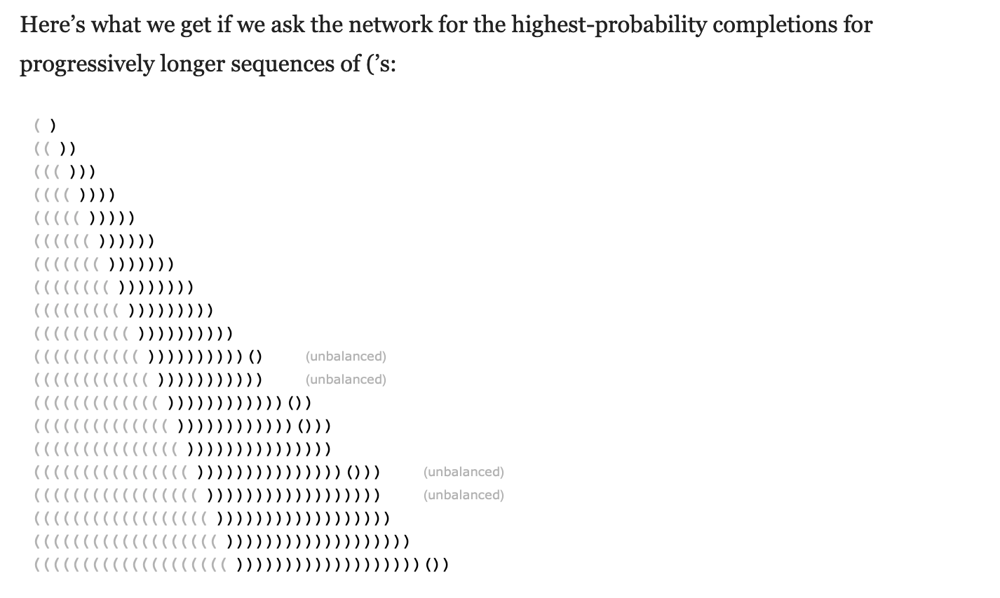
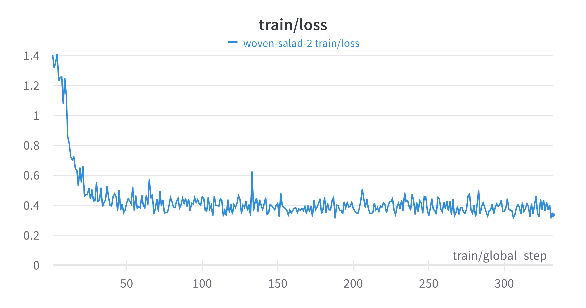

# JSON unscrambler

This repo contains the code and report for the Agemo AI Research Engineer take-home task.

## Introduction

The challenge presented explores a common issue encountered when trying to use LLMs to return output in a strict format or schema. We are told that a production system has a tendency to sometimes produce "micro-scrambled" JSON data. Our challenge is to develop a solution using NLP techniques that can take such a string as input and produce a valid JSON output.

## First thoughts

This is an interesting challenge — an obvious problem that needs a robust solution to ensure a reliable system. I actually remember thinking about this when reading Stephen Wolfram's [famous blog post](https://writings.stephenwolfram.com/2023/02/what-is-chatgpt-doing-and-why-does-it-work/) explaining how LLMs work. He discusses how attention does a good job of producing output that conforms to the rules of a grammar — but it's not perfect.


In this challenge, we have a system that produces unreliable JSON output and we want to develop another system to fix any invalid outputs. Ideally, the issue would be addressed upstream; i.e. at the original LLM producing the output. Various libraries such as [Outlines](https://github.com/outlines-dev/outlines) and [ReLLM](https://github.com/r2d4/rellm) try and solve this problem. They work by masking the logits of any candidate tokens that a LLM generates which do not conform to the rules of a given grammar.
For this project, we will assume that we don't have access to the upstream LLM and need to develop a system to fix broken JSONs. 

Several options are available, such as the RAG, which might provide a satisfactory solution if we were to use a hosted LLM like GPT-4. However, we hope to get more control and build a more robust system by fine-tuning a custom LLM specifically for this task. 


## Proposed Solution

To tackle this problem, we decided to fine-tune a llama-2-7b model using a training dataset of scrambled and unscrambled JSONs.
We used Google Colab's free T4 GPU instance. With only 15GB VRAM, we had to use 4-bit quantisation to compress the model and ran QLoRa fine-tuning.

To construct a training dataset, we used the provided `json_scrambler.py` script, which adds random syntactic errors to given JSON strings. 
We considered taking an approach like [Jsonformer](https://github.com/1rgs/jsonformer) to get a model to only generate content and fit it into a fixed JSON schema. However, given the varying nature of schemas in the provided example JSONs, we wanted to develop a general-purpose solution that can fix any JSON with syntactic errors.
We therefore created a collection of text sequences using the following prompt template:

```
Below is a JSON string containing a syntactic error. Return the corrected JSON string.

### Broken JSON:
{}

### Repaired JSON:
{}
```
By fine-tuning a Llama model using a dataset of sequences of this type, we expect the model to learn how to repair unseen scrambled JSONs.

We had planned to use the provided JSON strings from Agemo; however, many resulted in prompts that exceeded the token limit for Llama models. So instead, we generated synthetic JSON data, each of which are sufficiently short but with varying schemas.
The notebook `data_gen.ipynb` contains the code used to generate the JSON data. This resulted in 5,910 samples, of which 10% were held out for validation.

Getting the model to train without running into OOM issues was a challenge. However, using the configuration recommended in this [huggingface](https://huggingface.co/blog/4bit-transformers-bitsandbytes) bitsandbytes tutorial, we ran 1 epoch of fine-tuning, which took roughly 2 hours. Below is a plot of the training loss.
The code used to run the training can be found in the `fine-tuning.ipynb` notebook.


## Results

The results on the hold-out data demonstrate that the fine-tuned model effectively corrects broken JSONs. Of the 591 validation samples, 99% were successfully unscrambled. Only 6 samples failed, 3 of which were due to me mistakenly forgetting to remove the `max_new_tokens` argument when I generated the responses. The code used to validate the model can be found in the `validation.ipynb` notebook.

## Future Steps / Considerations for Production Use

The developed model clearly shows a lot of promise for solving this issue. With more computational resources, a larger and more capable model could be fine-tuned using this strategy. The scripts I have developed test the model by running inference directly on the adapted transformer. This is clearly inefficient, taking ~8 seconds on Google colab to unscramble a single JSON. I had hoped to package the fine-tuned model into a quantised binary using `llama.cpp` so that it could be easily run on basic hardware using something like Simon Willison's [llm](https://github.com/simonw/llm) CLI utility. Unfortunately, I ran into issues converting the model and ran out of time. 

Beyond just scaling up and speeding up this solution approach, there are other strategies we could explore. We could look at using different base models, such as models tailored to code; we could explore models with other architectures, e.g. seq2seq models could be promising for this task; we could explore incorporating generation guiding techniques such as those previously mentioned.

## Conclusion

This project captures our efforts to unscramble "micro-scrambled" JSON in LLM outputs using NLP techniques. Whilst not a comprehensive solution, it presents a promising first step towards robust handling of such issues. With more extensive data and computational resources, a robust solution could be developed using this strategy. Alternatively, upstream solutions could be considered to prevent invalid JSONs from being generated in the first place. 